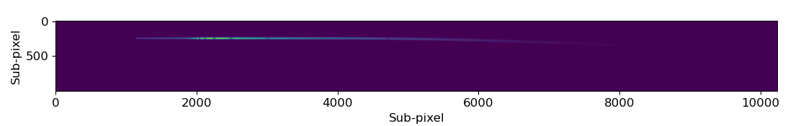

=====
HIDRA
===== 
~~~~~~~~~~~~~~~~~~~~~~~~~~~~~~~~~~~~~~~~~~~~~~~~~~~
Hyperspectral Instrument Data Resemblance Algorithm
~~~~~~~~~~~~~~~~~~~~~~~~~~~~~~~~~~~~~~~~~~~~~~~~~~~
This python 3.6+ package is capable of simulation spectroscopic observations of stellar spectra, from photons arriving at the telescope, to the photo-electrons being detected by a CCD. 

The scripts were created as a part of my Master's thesis, which was titled "Simulating multi-wavelength observations from low-resolution spectrographs".

Author: Lasse L. S. Berthelsen

- `More documentation <https://hidra.readthedocs.io/en/latest/>`_
- `Thesis <https://github.com/lasseleth/HIDRA/blob/master/thesis/Thesis_Lasse.pdf>`_

The spectra included in the *sample_values* folder were generated using `SPECTRUM <http://www.appstate.edu/~grayro/spectrum/spectrum.html>`_.

Installation
~~~~~~~~~~~~

The best way to install ``HIDRA`` is to clone the repository to your local folders,

.. code-block:: bash

   git clone https://github.com/lasseleth/HIDRA.git

And then importing the package in your script:

.. code-block:: python
   
   import HIDRA 

There are several functions to use in HIDRA.py, and a demo-script is included in the repository, called sample_simulations.py
The inputs of the simulation can be changed in the input_file.py. Values of several of the inputs, such as CCD subpixel variation, or spacecraft jitter can be generated using the functions included in HIDRA.

Simulating a stellar observation
~~~~~~~~~~~~~~~~~~~~~~~~~~~~

Given a 1D spectrum of a target star, this package produces a 2D 
image of how this spectrum would appear on a CCD. 
To make a simple simulation, my code might look like:

.. code-block:: python

   # Imports
   import HIDRA
   import input_file as inp
   
   #Setup the code using user-defined inputs. These can be adjusted in the input file
   spec_eff, spec_eff2, jitter, x_j, y_j, psf, img_size, sub_pixel, pl_arc_pix, disper, mask, slitpos, background = HIDRA.setup(inp)
   
   image, image_wl=HIDRA.disperser(wl_endpoints=wl_ran, jit_img=jitter, psf_img=psf, pos=slitpos, image_size=img_size, 
                                        dispersion=disper, eff=spec_eff, mask_img=mask, steps=1, plot='n')

The output of a single simulation run. 

Simulating a transmission spectrum as observed by the setup
~~~~~~~~~~~~~~~~~~~~~~~~~~~~~~~~~~~~~~~~~~~~~~~~~~~~~~~~~~~
In order to simulate a single transmission spectrum of an exoplanet transiting a star, a sample code might look like the following:

.. code-block:: python

   import HIDRA
   import input_file as inp
   
   spec_eff, spec_eff2, jitter, x_j, y_j, img_size, sub_pixel, pl_arc_mm, disper, mask, slitpos, background = HIDRA.setup(inp)

   in_spec = np.loadtxt(inp.in_spec)
   in_spec2 = np.loadtxt(inp.in_spec2)
   wl_ran = inp.wl_ran
   exp = inp.exp
   slit = inp.slit
   CCD = np.load(inp.in_CCD)
   #### SETUP PHASE COMPLETE ####
   
   #### IMAGE FORMATION BEGINS ####
   image1, image_wl1=HIDRA.disperser(wl_endpoints=wl_ran, jit_img=jitter, psf_ends=[15, 45], pos=slitpos, image_size=img_size, 
                                           dispersion=disper, eff=spec_eff, mask_img=mask, steps=1, plot='n')
   
   image2, image_wl2=HIDRA.disperser(wl_endpoints=wl_ran, jit_img=jitter, psf_ends=[15, 45], pos=slitpos, image_size=img_size, 
                                           dispersion=disper, eff=spec_eff2, mask_img=mask, steps=1, plot='n')
   
   ro = image1
   ri = image2
   no = HIDRA.noise(size=ro.shape, image=ro)
   ni = HIDRA.noise(size=ri.shape, image=ri)
   ri = ri+ni
   ro = ro+no
   del no, ni, image1, image2
   ro, ri, wave, delta = HIDRA.the_thing(image=ro, image2=ri, sub_pixel=sub_pixel, wl_ran=inp.wl_ran, disper=disper, 
                                            slitpos=slitpos, img_size=img_size, move="y", noiseinp="n")
   plt.plot(wave, (r1-r2)/r1)
   

The resultant transmission spectrum. Evidently, this setup seems unlikely to detect the atmosphere of this planet. To truly tell though, you should repeat the simulations, using a different jitter each time, and use all observations in the data-processing.

~~~~
FAQ
~~~~
What dependencies does HIDRA have?
~~~~~~~~~~~~~~~~~~~~~~~~~~~~~~~~~~
In order to use HIDRA, you need to have installed the following packages: Astropy, Numpy and Scipy. Also, I would recommend having Matplotlib, for plotting, etc.

Can I use/change and otherwise edit this code?
~~~~~~~~~~~~~~~~~~~~~~~~~~~~~~~~~~~~~~~~~~~~~~
Yes, please do! Remember that the code is provided "*as is*", and there are no garanties to the functionality. If you make a neat new feature, or something you feel should be added, please contact me, and I'll add it to the master branch.

~~~~~~~
License
~~~~~~~
See the `LICENSE <https://github.com/lasseleth/HIDRA/blob/master/LICENSE>`_ file for license rights and limitations (MIT).

